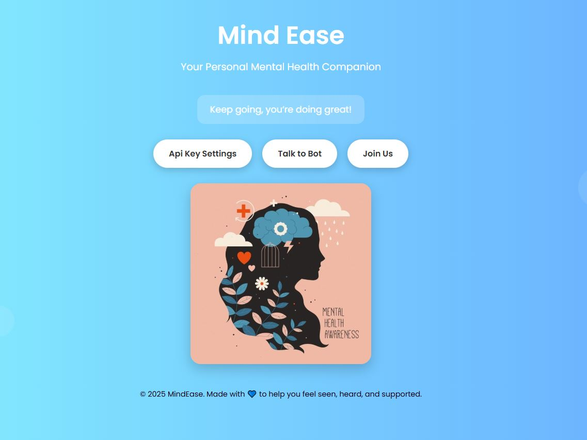
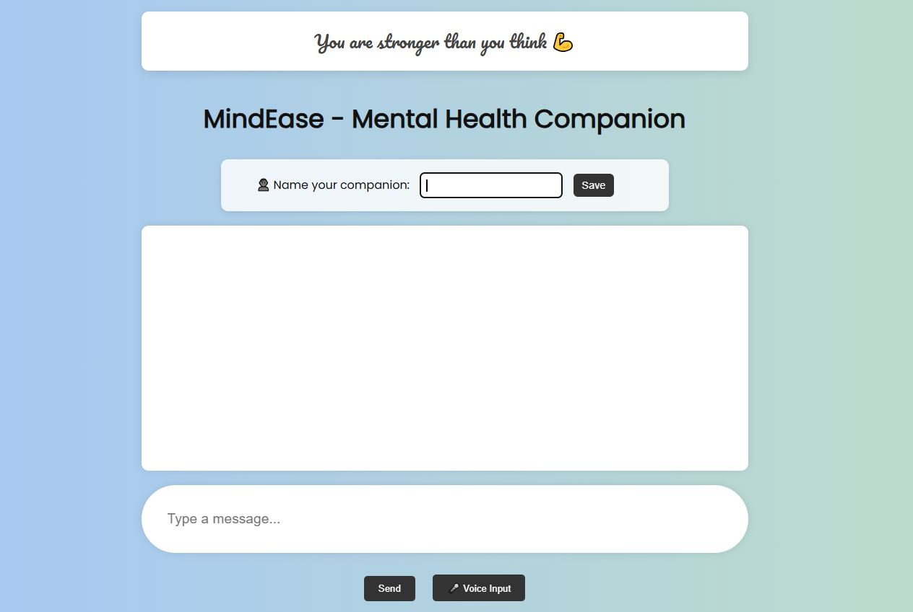
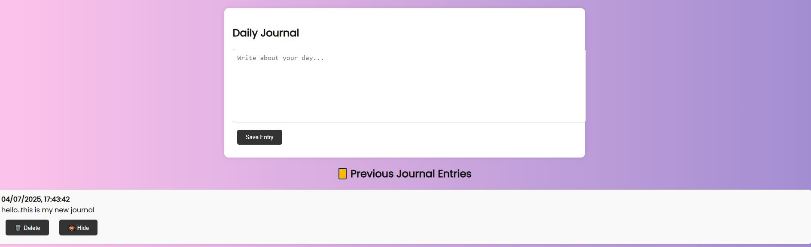
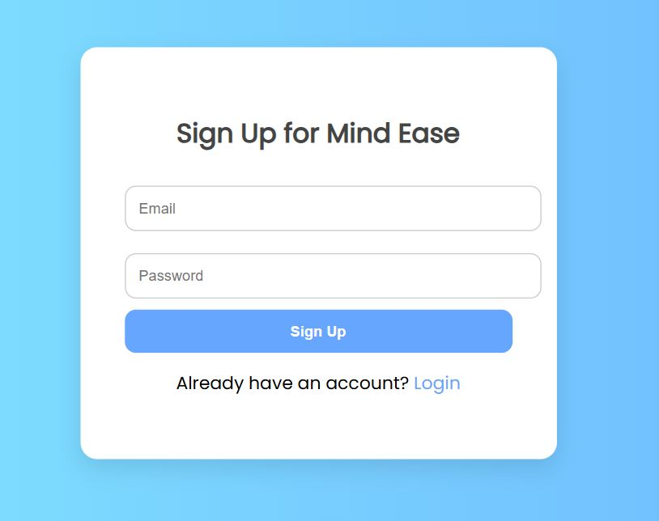

# 🧠 MindEase — Your Personal Mental Health Companion

Welcome to **MindEase**, a mental health chatbot built using Flask and AIML, designed to help users track their feelings, manage stress, and express themselves freely through journaling and daily affirmations.

I created this project as a way to combine technology and empathy — to provide a space where anyone can talk, reflect, and feel heard. 💙

---

## ✨ Features

- 🗨️ **Chat Interface** powered by AIML (Artificial Intelligence Markup Language)
- 🧠 **Stress Level Detection** using keywords and sentiment analysis
- 📝 **Daily Journaling** with view, edit, delete, hide/unhide support
- 💬 **Voice Input** support using Speech Recognition
- 🌈 **Daily Affirmations** to keep you going
- 🎨 Beautiful UI with animated background and theme toggle
- 🔐 **Login & Signup Authentication** (email + password)

---

## 🛠️ Tech Stack

| Layer         | Technology                    |
|--------------|-------------------------------|
| Backend       | Flask, AIML, SQLite, TextBlob |
| Frontend      | HTML, CSS, JavaScript         |
| Voice Input   | Web Speech API (Browser)      |
| Styling       | Custom CSS + Gradient Effects |
| Deployment    | Localhost (Flask server)      |

---

## 🚀 How to Run Locally

1. **Clone this repository**

```bash
git clone https://github.com/your-username/mental-health-chatbot.git
cd mental-health-chatbot
```

2. **Install dependencies**

```bash
pip install -r requirements.txt
```

3. **Run the Flask app**

```bash
python app.py
```

4. **Visit in browser**

Go to `http://127.0.0.1:5000/` in your browser.

---
## 🖼️ Screenshots

### 🏠 Home Page


### 💬 Chat Page


### 📓 Journal Page


### 🔐 Login / Signup



## 🧘‍♀️ Why I Built MindEase

Mental health is something I care deeply about. I wanted to create a space where users could:

* Talk freely (even with voice)
* Track their emotions and stress
* Write down their feelings in a private journal
* Get a little motivation every day 🌻

This is my attempt to mix **compassion with code** 💻💖

---

## 📁 Folder Structure

```
├── static/
|         
│  └── images/
├── templates/
│   ├── index.html
│   ├── chat.html
│   ├── login.html
│   └── signup.html
├── app.py
├── requirements.txt
└── README.md
```

---

## 🙋‍♀️ About Me

Hi! I'm Jaspreet Kaur, and I'm passionate about building meaningful tech.
Feel free to connect if you’d like to collaborate or talk mental health & development. ✨

Github: https://github.com/Jaspreetkaurr21/
LinkedIn: https://www.linkedin.com/in/jaspreet-kaur-209088299/
---


