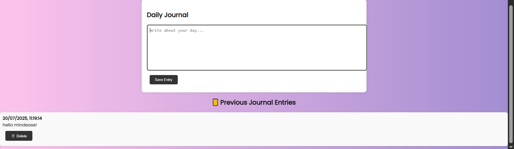

# 🧠 MindEase — Your Personal Mental Health Companion

Welcome to **MindEase**, an AI-powered mental health web app built using **Flask** and integrated with **OpenRouter's LLMs** like OpenChat and DeepSeek. It helps users talk to AI, manage stress, journal thoughts, and receive daily affirmations — all through a beautiful interface.

This project combines **technology and empathy** to offer users a calming and safe space to reflect, express, and heal. 💙

---

## ✨ Features

- 💬 **AI Chat Interface** (powered by OpenRouter)
- 🧠 **Stress Level Detection** using keyword and sentiment analysis
- 📓 **Journal Entries** with create, edit, delete
- 🎙️ **Voice Input** using Web Speech API
- 🌞 **Daily Affirmations or Quotes**
- 🌈 **Animated Gradient UI** with Dark/Light Theme Toggle
- 🔐 **Login & Signup** with email/password authentication
- 🔑 **User API Key Input** (OpenRouter API key via frontend)

---

## 🛠️ Tech Stack

| Layer           | Technology                          |
|----------------|-------------------------------------|
| Backend         | Flask, SQLite, TextBlob             |
| AI Integration  | OpenRouter API (e.g. OpenChat 3.6)  |
| Frontend        | HTML, CSS, JavaScript               |
| Voice Input     | Web Speech API                      |
| Authentication  | Flask Login                         |
| Styling         | CSS with Animated Gradients         |

---

## 🚀 Getting Started (Local Setup)

Follow the steps below to run the project on your system:

### 1. Clone the Repository

```bash
git clone https://github.com/Jaspreetkaurr21/mental-health-chatbot.git
cd mental-health-chatbot

```
### 2.Create and Activate a Virtual Environment
For windpws:
python -m venv env
env\Scripts\activate

For macOS/Linux:
python3 -m venv env
source env/bin/activate

### 3.Install Dependencies
pip install -r requirements.txt

### 4.Run the Flask App
python app.py

### 5.Open in browser
Visit: http://127.0.0.1:5000

## Folder Structure
mental-health-chatbot/
│
├── static/
│   └── images/
│
├── templates/
│   ├── index.html
│   ├── chat.html
│   ├── journal.html
│   ├── login.html
│   ├── signup.html
│   └── apikey.html
│
├── app.py
├── requirements.txt
└── README.md

## 🖼️ Screenshots
### 🏠 Home Page


### 💬 Chat Page


### 📓 Journal Page


### API key


### Login page


## 💡 Why I Built MindEase


Mental health is personal and important. I wanted to create a space where users can:

-Talk to AI without judgment

-Track stress and emotions

-Maintain a private journal

-Get small doses of positivity daily 🌻

-This is my way of blending compassion and code to help others. 💻💖

## 🙋‍♀️ About Me
Hi! I'm Jaspreet Kaur, a third year B.Tech student at NIT Jalandhar passionate about building tech that truly helps people.

💼 GitHub:[ @Jaspreetkaurr21](https://github.com/Jaspreetkaurr21)
💬 LinkedIn: [Jaspreet Kaur](https://www.linkedin.com/in/jaspreet-kaur-209088299/)

## 📢 Note
This project is fully AI-powered.
It uses OpenRouter's LLM APIs, and users can securely enter their own API key directly on the frontend.